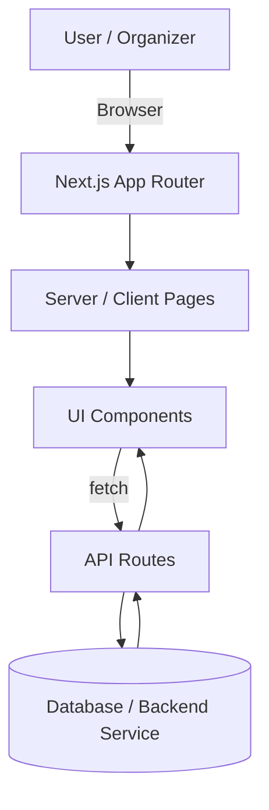

# CMIsomer

CMIsomer is a **Next.js (App Router) event management platform** for student organizations.
It supports **party creation, ticketing, timeslot-based registration, and capacity analytics**.

Designed for clarity, scalability, and fairness in high-demand student events.

---

## Tech Stack

- **Framework:** Next.js (App Router)
- **Language:** TypeScript
- **Frontend:** React Server & Client Components
- **Backend:** Next.js API Routes
- **Styling:** Tailwind CSS
- **UI:** shadcn-style reusable components

---

## Project Structure

```
app/
├── page.tsx                # Landing page
├── layout.tsx              # Root layout & providers
├── create/                 # Party creation flow
├── party/[slug]/           # Public party pages & ticketing
└── api/                    # Backend route handlers

components/
├── ui/                     # Reusable UI primitives
└── domain/                 # Party / registration logic

lib/                        # Utilities
public/                     # Static assets
```



---

## Core Flows

### Party Creation
Organizers create events via `/create`, submitting metadata such as party name, capacity,
and timeslots. Data is persisted through API routes and exposed via a public party page.

sequenceDiagram
    participant User
    participant PartyPage
    participant TicketPage
    participant API
    participant DB

    User->>PartyPage: Visit /party/{slug}
    PartyPage->>API: Fetch party metadata
    API->>DB: Query party
    DB-->>API: Party data
    API-->>PartyPage: Render party info

    User->>TicketPage: Register / claim ticket
    TicketPage->>API: Submit registration
    API->>DB: Insert registration
    DB-->>API: Success
    API-->>TicketPage: Confirmation


### Registration & Ticketing
Users visit `/party/[slug]` to view event details and register for tickets or timeslots.
Capacity and organizational constraints are enforced server-side.

### Analytics
Registration counts and breakdowns are fetched through API routes and used to render
capacity indicators and charts.

GET /api/registrations/count?partySlug=xyz&timeslot=18:00

### UI
components/ui/
- Stateless
- Highly reusable
- Tailwind-only styling
- No business logic

Examples:
- button.tsx
- card.tsx
- dialog.tsx
- popover.tsx

Domain Components
- Live outside components/ui
- Handle:
    - API calls
    - State
    - Event-specific logic
- Example:
    - Timeslot availability charts
    - Registration breakdowns

---

## API Overview

- `GET /api/registrations/count`
  - Returns confirmed and pending registration counts
  - Used for live availability and analytics

---

## Local Development

See SETUP.md

---

## Development Philosophy

- Prefer **Server Components** by default
- Keep **business logic in API routes**
- Reuse `components/ui` for consistent design
- Avoid duplicating logic in the frontend

---

## Maintainers

CMIsomer is maintained by CMU student organizers and contributors.